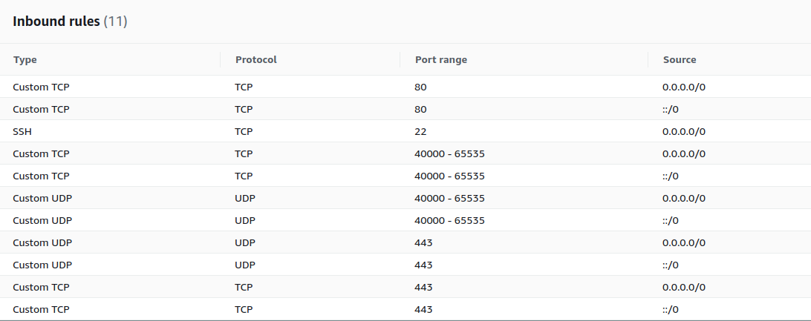

# Coturn deployment with SSL at port 443

:warning: :warning: :warning: **WARNING** :warning: :warning: :warning:

> This repository is deprecated in favor of this guide to deploy a external Coturn service to allow users behind firewalls using port 443 with SSL (working for OpenVidu >= 2.21.0): 
> https://docs.openvidu.io/en/stable/deployment/allow-users-behind-firewalls/
> 
> If you are using version < 2.21.0, this repository and this guide still valid to you, but our recommendation is to update to the latest version and use the official guide from the documentation

:warning: :warning: :warning: **WARNING** :warning: :warning: :warning:

This Coturn is an automation to deploy a (STUN/TURN server) deployment listening at port 443 with an SSL/TLS Letsencrypt certificate. This Coturn (STUN/TURN server) deployment will be prepared to work with strict firewalls.

The process to install and configure it for OpenVidu is very simple. You just need to follow the next instructions.

# 1. Requirements

You need an individual Linux machine which should have:

1. A **public IP**
2. A **FQDN pointing to this public IP**. No proxys or anything else, just a simple domain/subdomain with a registar of type A pointing to its public IP.
3. Recommended requirements: 4 CPUs and 4 GB of RAM. This is a generous setup, it depends of your use case. The more people using relay connections, the more consumption it will have.
4. **Docker** and **docker-compose** installed.

Also, you will need to open these ports:

> - Port 80 TCP is needed by certbot to renew certificates
> - Port 443 TCP/UDP is needed to connect to coturn from browsers
> - 40000 - 65535 TCP/UDP is needed for Coturn to connect to relayed peers outside the network
> - Port 22 TCP is only necessary if you want to SSH into your instance


4. If an application is running in one of the above mentioned ports, the deployment will not work as it is intended. All of these ports must be available for this deployment.


# 2. Installation

1. SSH into the machine you will deploy coturn

2. Git clone this repository in `/opt` as sudo, and enter to its directory
```
sudo su
cd /opt
git clone https://github.com/OpenVidu/openvidu-external-coturn.git
cd openvidu-external-coturn
```
3. Fill in the file `/opt/openvidu-external-coturn/.env` these environment variables:
- `COTURN_DOMAIN_NAME`: The domain which is pointing to the public ip of the machine.
- `LETSENCRYPT_EMAIL`: The email you want to use for letsencrypt
- `TURN_USERNAME`: Turn username fixed credential
- `TURN_PASSWORD`: Turn password fixed credential

4. Execute coturn:
```
./openvidu_coturn --start
```

Don't worry about some coturn errors in the log. Coturn is too verbose by default but most errors are not important.
The important thing is that you see this kind of logs:
- Certificates loaded:
```
0: : <SSL_TLS_DTLS_VERSION>: Certificate file found: /etc/letsencrypt/live/<COTURN_DOMAIN_NAME>/cert.pem
...
0: : <SSL_TLS_DTLS_VERSION>: Certificate file found: /etc/letsencrypt/live/<COTURN_DOMAIN_NAME>/privkey.pem
```

- Listener logs information:
```
IPv4. ... listener opened on : 0.0.0.0:443
```


Now you have your Coturn prepared to listening at standard SSL port 443.

# 3. Check your Coturn (STUN/TURN) server instalation

To ensure your external coturn is working correctly, you can test it with [Trickle Ice](https://webrtc.github.io/samples/src/content/peerconnection/trickle-ice/):


 correct setup should return to you this in Chrome browser:


# 4. OpenVidu browser configuration

Every time the instance of `OpenVidu` is instanciated in your frontend app using `openvidu-browser` you need to configure to use the STUN/TURN server we've configured:

```js
// This openvidu instance should be somewhere in your app
let openvidu = new OpenVidu();

// This is the important part, where we're configuring the new STUN/TURN deployment
let turnUsername = <TURN_USERNAME>;
let turnCredential = <TURN_PASSWORD>;
openvidu.setAdvancedConfiguration({
    iceServers: [
        {
            urls: "turn:<COTURN_DOMAIN_NAME>:443?transport=udp",
            username: turnUsername,
            credential: turnCredential
        },
        {
            urls: "turn:<COTURN_DOMAIN_NAME>:443?transport=tcp",
            username: turnUsername,
            credential: turnCredential
        },
        {
            urls: "turns:<COTURN_DOMAIN_NAME>:443?transport=tcp",
            username: turnUsername,
            credential: turnCredential
        }
    ]
});
```

In this code you need to replace:
- `COTURN_DOMAIN_NAME`: the domain name you are using for your Coturn server.
- `TURN_USERNAME`: Username fixed credential
- `TURN_PASSWORD`: Password fixes credential
